## Fase 2: Implementación, Sembrado de Datos y Consultas CRUD

### Base de datos y colecciones

- Base de datos: `caxambu-nosql` (MongoDB local, gestionado con MongoDB Compass)
- Colecciones: `clientes`, `productos`, `pedidos`

### Sembrado de datos (seed)

Los archivos están en la carpeta [`/scripts`](./scripts): `clientes.json`, `productos.json` y `pedidos.json` (10 documentos por colección), más `queries.js` con todas las consultas y operaciones comentadas.

**Flexibilidad del esquema (schema-less):** los documentos de una misma colección no comparten exactamente la misma estructura, según lo que necesita el negocio:

- **Clientes:** `perfil.telefono`, `puntos_fidelidad` y `direccion_envio` son opcionales (solo algunos clientes los tienen).
- **Productos:** los cafés en grano incluyen el subdocumento `detalles_especialidad` (origen, región, proceso, notas de cata); las cafeteras y accesorios usan otros campos (`marca`, `garantia_meses`, `voltaje`, etc.), y la pastelería usa `ingredientes`, `vegano` y `apto_celiaco`.
- **Pedidos:** `direccion_entrega` solo existe en pedidos con delivery, `descuento` solo en algunos pedidos, y `variante_molienda` solo en los ítems de café. Además, los pedidos tienen distinta cantidad de ítems.

### Consultas de Lectura

**1. Filtrado básico por coincidencia exacta**
```js
db.pedidos.find({ estado: "Entregado" })
```
Resuelve: mostrar en el panel de gestión todos los pedidos ya entregados, para llevar el control diario de despachos.

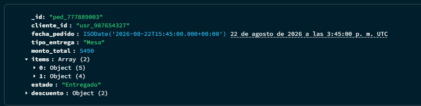
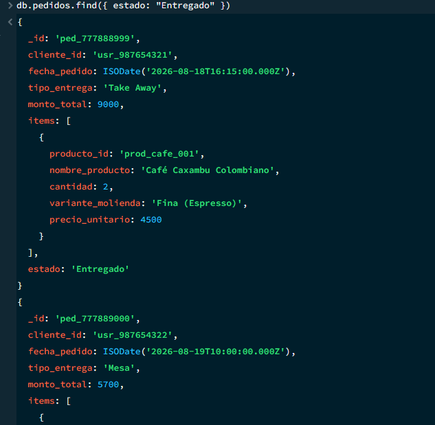
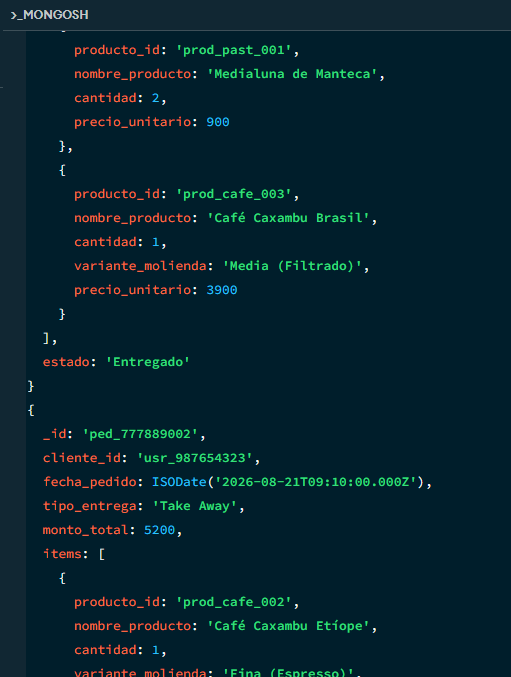
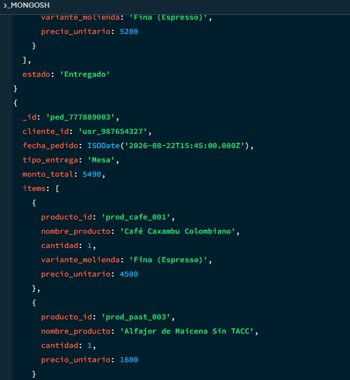
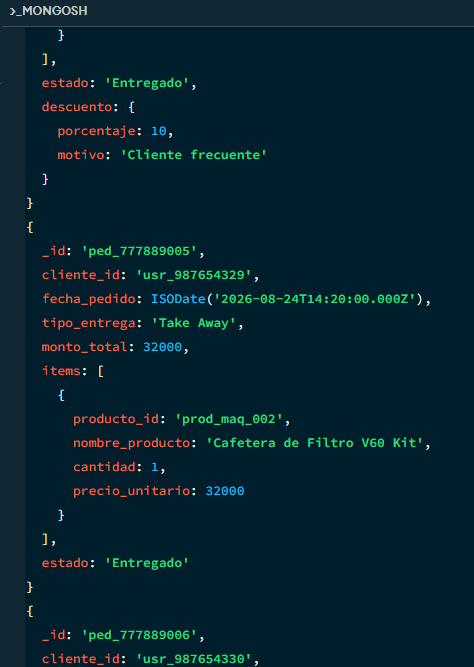
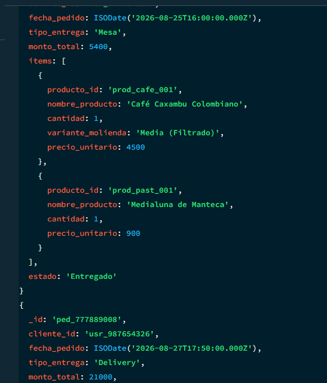

**2. Operador de comparación ($lt)**
```js
db.productos.find({ stock: { $lt: 10 } })
```
Resuelve: generar una alerta de reposición para los productos con stock bajo antes de que se agoten.

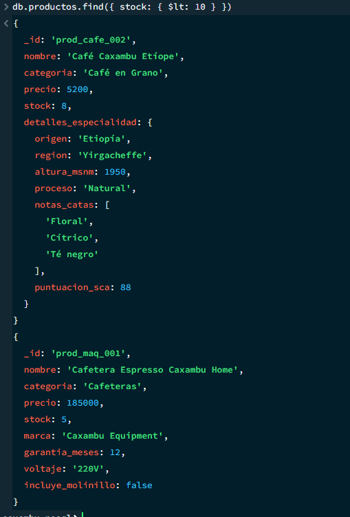

**3. Notación de punto sobre campos anidados**
```js
db.productos.find({ "detalles_especialidad.origen": "Colombia" })
```
Resuelve: filtrar el catálogo de café en grano por país de origen para armar promociones temáticas.

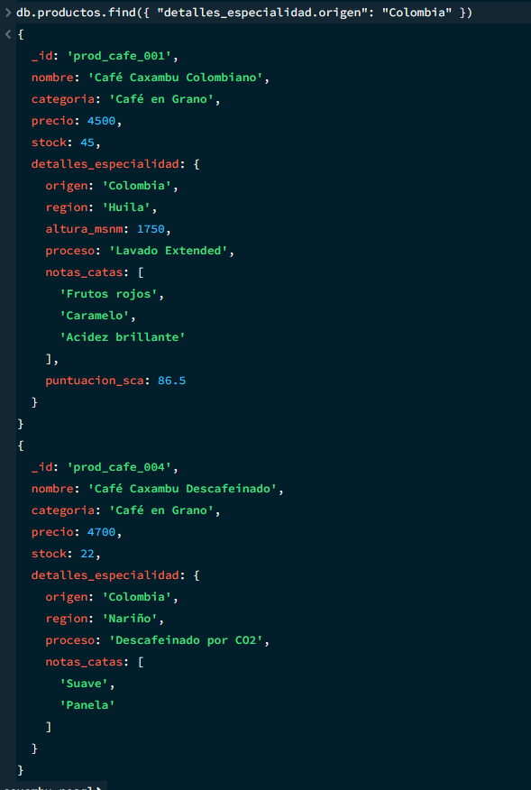

**4. Proyección de campos específicos**
```js
db.clientes.find({}, { _id: 0, nombre: 1, email: 1 })
```
Resuelve: generar una lista liviana de contacto de clientes para campañas de mailing, sin exponer teléfono ni dirección.

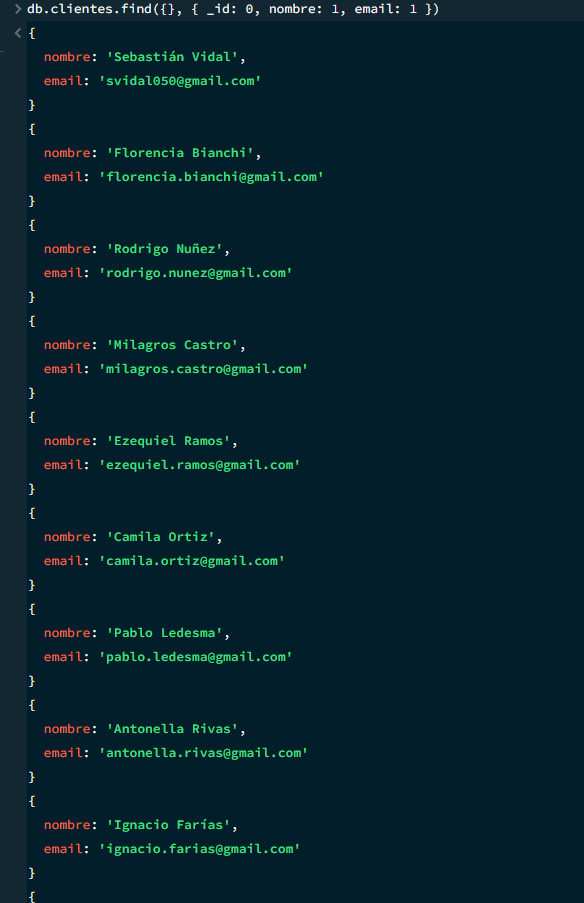
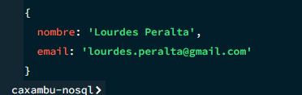

**5. Filtrado dentro de un arreglo ($elemMatch)**
```js
db.pedidos.find({ items: { $elemMatch: { variante_molienda: "Fina (Espresso)" } } })
```
Resuelve: identificar qué pedidos incluyeron molienda espresso, útil para estadísticas de consumo por tipo de preparación.

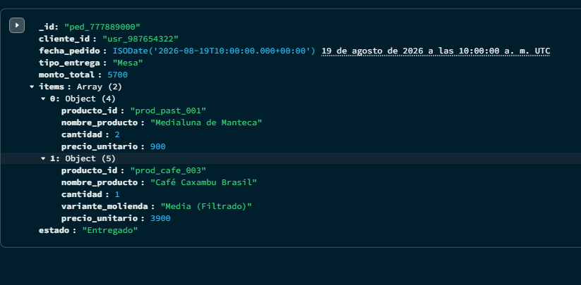
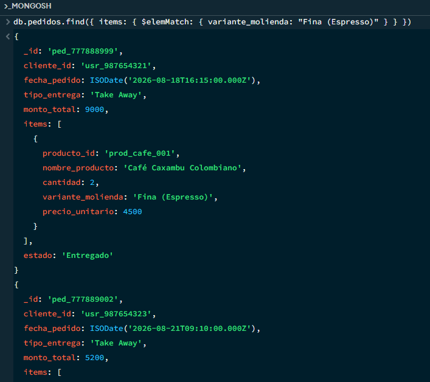
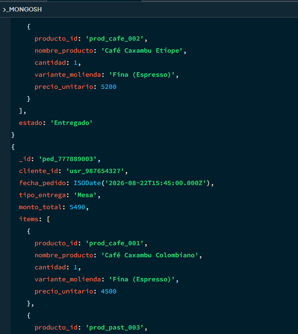
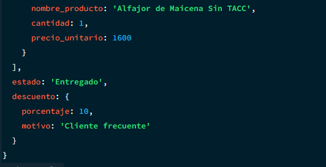

### Operaciones de Escritura

**1. Actualización con $set**
```js
db.productos.updateOne(
  { _id: "prod_cafe_002" },
  { $set: { precio: 4800.00, en_oferta: true } }
)
```
Resuelve: actualizar el precio de un producto y agregar la propiedad `en_oferta` desde el panel de administración.

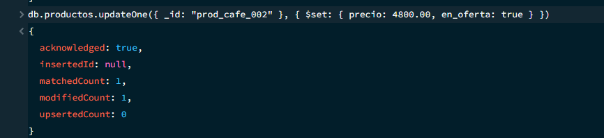

**2. Actualización atómica con $inc**
```js
db.productos.updateOne(
  { _id: "prod_cafe_001" },
  { $inc: { stock: -2 } }
)
```
Resuelve: descontar stock automáticamente al concretarse una venta, sin recalcular el inventario completo.


**3. Eliminación segura con deleteOne**
```js
db.pedidos.deleteOne({ _id: "ped_777889004" })
```
Resuelve: eliminar un pedido cancelado puntual, filtrando por su ID exacto para no afectar otros registros.

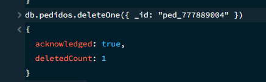
